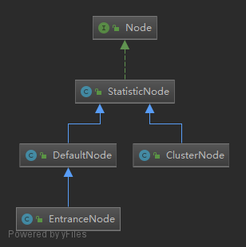

1. Entry中originNode，与curNode区别与作用

ResourceMapper就是定义资源结构，名称和类型
Node 是定义统计数据的基本结构

Context中的defaultNode和Entry中的两个Node有何区别

1. 最小基本单元是Entry，包含了资源结构ResourceMapper,，和统计节点单元Node。
Sph中定义了构建Entry的方法
SphU负责对外提供Entry的构造方法，Context负责构建Node和Entry

全局的问题：

1. 如何计算路径的统计值的

2. 如何进行配置的持久化扩展的

